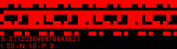
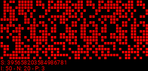
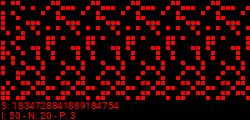
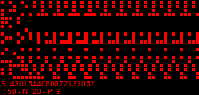
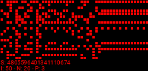
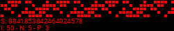
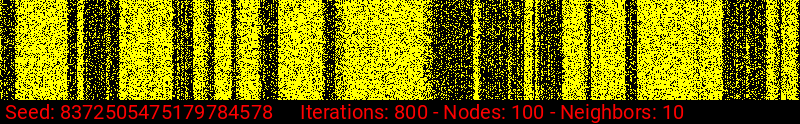

# Inspiration
[Random Boolean Networks - Computerphile](https://www.youtube.com/watch?v=mCML2B94rUg)

# System
## Setup
* Initialize [Truth Table](#truth-table) with an initial random state
* Instantiate `20` nodes with a random initial boolean state
  * For each node: Set up [Node connections](#node-connections)

## Node connections
Example:

    00 -> 09 04 11
    01 -> 04 04 07
    02 -> 08 18 12

A node can be connected to another time multiple times as seen above with `01 -> 04 04 07`

## Truth Table
Example:
| index | input | value |
|-------|-------|-------|
| 0     | 000   | 1     |
| 1     | 001   | 0     |
| 2     | 010   | 0     |
| 3     | 011   | 1     |
| 4     | 100   | 0     |
| 5     | 101   | 0     |
| 6     | 110   | 1     |
| 7     | 111   | 1     |

# Example images

Using a pixel-scaling factor of 5

  

Generated with older version

